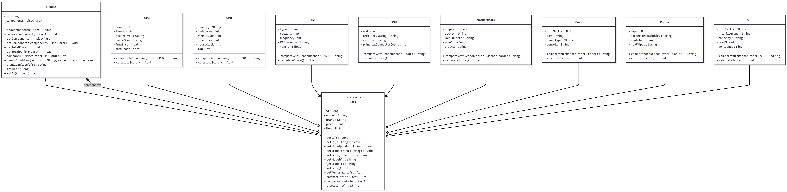

#  PcForge - Forging the best PC for you

---
## 🧩 Introduzione

**PCForge** è una piattaforma pensata per guidare gli utenti nella costruzione del **Personal Computer** ideale in base a esigenze, preferenze e budget.

Nata come strumento di comunicazione tra sviluppatori e utenti, il progetto si è evoluto in una piattaforma completa che permette:
- generazione automatica di build;
- confronto tra build (comparator);
- interazione via chat con tecnici;
- discussione pubblica su forum;
- gestione di un sistema di punti per i tecnici.

---
## ⚙️ Architettura del sistema

PcForge segue un'architettura a **microservizi** con un **Gateway** che funge da punto di ingresso per i client.

- **Gateway** — unico punto di accesso, instrada le richieste ai microservizi e applica i controlli di sicurezza/ autorizzazione.
- **Microservizi** — servizi indipendenti che espongono funzionalità specifiche (auth, chat, forum, build generator, saldo punti, ecc.).

```
it.unisannio.pcforge
   |
   |-- gateway
   |     |-- controller
   |     |-- security
   |     |-- UI/UX
   |
   |-- authentication
   |     |-- controller
   |     |-- service
   |     |-- persistence
   |            |-- mapper
   |
   |-- buildgenerator
   |     |-- controller
   |     |-- service
   |     |-- persistence
   |
   |-- chat
   |     |-- controller
   |     |-- service
   |     |-- persistence
   |            |-- mapper
   |
   |-- forum
   |     |-- controller
   |     |-- service
   |     |-- persistence
   |            |-- mapper
   |
   |-- saldopunti
   |      |-- controller
   |      |-- service
   |      |-- persistence
   |            |-- mapper
         
```

### Persistenza dei dati
- **NoSQL**: MongoDB — ideale per dati non strutturati (chat, forum, log).
- **SQL**: MySQL — utile per dati relazionali (modello build, transazioni).

---
## 🧱 Struttura di un microservizio

Ogni microservizio è organizzato in tre layer:

1. **Controller** — riceve le richieste dal Gateway e le passa ai servizi.
2. **Service** — logica di business, orchestrazione delle operazioni.
3. **Persistence** — accesso al database, mapping dati.

Questo approccio migliora manutenibilità, testabilità e permette deploy indipendenti.

---
## 🧠 Microservizi implementati

- **Authentication** — registrazione, login, gestione JWT e ruoli.
- **BuildGenerator / BuildComparator** — generazione e confronto delle build (unificati per evitare duplicazioni).
- **Chat** — messaggistica tra utenti e tecnici (storico, timestamp, gestione conversazioni).
- **Forum** — post, commenti e discussioni su build e componenti.
- **SaldoPunti** — gestione punti/crediti per tecnici e sistema di transazioni.

---
## 🔩 BuildGenerator & Pattern Composite

Il microservizio di build sfrutta il **pattern Composite** per rappresentare componenti semplici e composte della build (es: una Build che contiene CPU, GPU, RAM, ecc.). Questo facilita generazione e comparazione ricorsiva dei componenti.

# 

Le formule di comparazione pesano parametri come: frequenza, TDP, prezzo e metriche di benchmark per ottenere una metrica aggregata utilizzabile dal comparator.

---
## 🔐 Sicurezza e autenticazione

Sistema basato su **JWT** con due token:

- **Access Token** — breve scadenza, autenticazione alle risorse protette.
- **Refresh Token** — lunga scadenza, permette di ottenere nuovi access token senza login.

### Ruoli
- **Admin** — gestione completa del sistema.
- **User** — crea build, commenta, chattare con tecnici.
- **Technician** — riceve richieste dagli utenti, può offrire servizi e ricevere punti per i servizi forniti.

L’accesso agli endpoint è protetto tramite filtri e annotation in ingresso dal Gateway.

---
## 💻 Client frontend

Il client comunica col Gateway via **API REST**. Funzionalità principali:

- Login / register con sistema Remember Me.
- Dashboard con sidebar e pagine caricate dinamicamente.
- Profilo utente con modalità read-only / edit.
- Build Generator (crea build in base a criteri).
- Build Comparator (confronta due build).
- Forum (post, like, commenti).
- Chat (messaggi, storico, timestamp nelle bolle).

Frontend sviluppato in **HTML, CSS e vanilla JS** per mantenere il progetto leggero e facilmente modificabile.

---
## 🐳 Deployment & CI/CD

- Ogni microservizio è containerizzato con **Docker**.
- Pipeline CI/CD (GitLab) esegue build, test e pubblicazione delle immagini.
- Possibile deploy con Docker Compose o orchestratori (Kubernetes) su VM.

---
## 🧰 Tecnologie utilizzate

- **Backend**: Spring Boot, Maven
- **DB**: MongoDB (NoSQL), MySQL (SQL)
- **Container**: Docker
- **Frontend**: HTML, CSS, JavaScript (+ Phosphor Icons)
- **CI/CD**: GitLab CI / Docker Registry

---
## 🚀 Roadmap / Backlog

Funzionalità pianificate / miglioramenti:
- **Admin Role** (gestione utenti, tecnici, forum, ecc.).
- **Notification Service** (real-time push).
- **Third-party Auth** (Google, Facebook, X).
- **VideoCall Service** (WebRTC per supporto tecnico live).
- **Shopping Service** (per acquisti tramite Amazon Affiliate o direttamente da PcForge).
- **Suggerimenti AI** (per build based on history/benchmarks).

---
## 📝 Note sul codice client

Il frontend include:
- caricamento dinamico di pagine via `fetch` (es. `loadPageFragment('profile')`);
- gestione read-only/edit per form profilo;
- logica comparator/copypaste per build;
- rendering di liste (posts, builds, skills) con placeholder;
- chat con bolle adattive e timestamp in basso a destra.

---
## 👥 Autori

<table>
  <thead>
    <tr>
      <th colspan="2" style="text-align:center;">Gruppo 9</th>
    </tr>
  </thead>
  <tbody>
    <tr><td>Francesco Battista</td><td>UI/UX Designer</td></tr>
    <tr><td>Luca Sacco</td><td>UI/UX Designer</td></tr>
    <tr><td>Simone Di Mario</td><td>Developer</td></tr>
    <tr><td>Carmela Mandato</td><td>Developer</td></tr>
    <tr><td>Giulia Di Biase</td><td>Developer</td></tr>
  </tbody>
</table>

---
## 📄 Licenza & note finali

Documento a scopo didattico/progettuale. Per produzione valutare:
- hardening delle API e rate limiting,
- centralizzazione dei log e monitoring,
- backup e disaster recovery,
- policy di sicurezza e privacy.

---
*PcForge — Forging the best PC for you.*
***